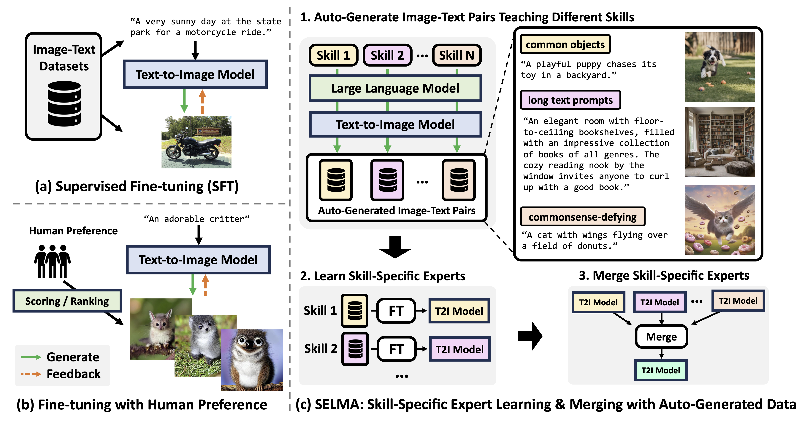

# SELMA: Learning and Merging Skill-Specific Text-to-Image Experts with Auto-Generated Data

* Authors: [Jialu Li](https://jialuli-luka.github.io/)\*, [Jaemin Cho](https://j-min.io/)\*, [Yi-Lin Sung](https://ylsung.github.io/), [Jaehong Yoon](https://jaehong31.github.io/) and [Mohit Bansal](https://www.cs.unc.edu/~mbansal/) (UNC Chapel Hill)

* [Paper](https://arxiv.org/abs/2403.06952)

Recent text-to-image (T2I) generation models have demonstrated impressive capabilities in creating images from text descriptions. However, these T2I generation models often fall short of generating images that precisely match the details of the text inputs, such as incorrect spatial relationship or missing objects.
In this paper, we introduce SELMA: Skill-Specific Expert Learning and Merging with Auto-Generated Data, a novel paradigm to improve the faithfulness of T2I models by fine-tuning models on automatically generated, multi-skill image-text datasets, with skill-specific expert learning and merging.
First, SELMA leverages an LLM’s in-context learning capability to generate multiple datasets of text prompts that can teach different skills, and then generates the images with a T2I model based on the prompts.
Next, SELMA adapts the T2I model to the new skills by learning multiple single-skill LoRA (low-rank adaptation) experts followed by expert merging.
Our independent expert fine-tuning specializes multiple models for different skills, and expert merging helps build a joint multi-skill T2I model that can generate faithful images given diverse text prompts, while mitigating the knowledge conflict from different datasets.
We empirically demonstrate that SELMA significantly improves the semantic alignment and text faithfulness of state-of-the-art T2I diffusion models on multiple benchmarks (+2.1% on TIFA and +6.9% on DSG), human preference metrics (PickScore, ImageReward, and HPS), as well as human evaluation.
Moreover, fine-tuning with image-text pairs auto-collected via SELMA shows comparable performance to fine-tuning with ground truth data. Lastly, we show that fine-tuning with images from a weaker T2I model can help improve the generation quality of a stronger T2I model, suggesting promising weak-to-strong generalization in T2I models.

<p align="center">

</p>


## Stage1: Prompt Generation with LLM

1. Follow the instructions [here](https://github.com/tatsu-lab/stanford_alpaca/tree/main) to install the environments for Prompt Generation.

2. Generate prompts or download our prompts from five different datasets [here](https://www.dropbox.com/scl/fo/xxgfjfqtxpmmqscydysib/h?rlkey=agg8vege1mmu43t44sak4wl8p&dl=0)

```
cd llm
CUDA_VISIBLE_DEVICES=0 python prompt_generation --output_dir "YOUR OURPUT DIR" --skills "Whoops"
```

* `output_dir`: Output directory of generated prompts.

* `skills`: Skills to generate. Selecting from [`Whoops`, `Localized Narrative`, `Coco`, `CountBench`, `DiffusionDB`]

* Update your OpenAI API under utils.py  `client = OpenAI(api_key="")`


## Stage2: Image Generation with Stable Diffusion

1. Follow the instructions [here](https://github.com/huggingface/diffusers) to install the environments for stable diffusion.

2. Generate images given prompts or download our auto-generated image-text pairs [here](https://www.dropbox.com/scl/fo/xxgfjfqtxpmmqscydysib/h?rlkey=agg8vege1mmu43t44sak4wl8p&dl=0):

```
cd image-generation
CUDA_VISIBLE_DEVICES=0 python img_gen_gpt.py --prompt_path "YOUR PROMPT PATH" --output_path "YOUR OUTPUT PATH"
```

* `prompt_path`: Path to prompts generated in Stage 1.

* `output_path`: Where to save the generated images.

* `model_id`: Which Stable Diffusion model to use. Selecting from [`stabilityai/stable-diffusion-2`, `"CompVis/stable-diffusion-v1-4"`, `"stabilityai/stable-diffusion-xl-base-1.0"`]. Defaults to `stabilityai/stable-diffusion-2`.

* `cache_dir`: Cache dir for downloading pre-trained Stable Diffusion model.

* `batch_size`: Batch size for generating images. Default to 1.

## Stage3: LoRA Expert Fine-tuning

1. Follow the instructions [here](https://github.com/huggingface/diffusers/tree/main/examples/text_to_image) to install the environments for fine-tuning SD and SDXL.

2. Fine-tune LoRA Expert or download our released checkpoints [here](https://www.dropbox.com/scl/fo/xxgfjfqtxpmmqscydysib/h?rlkey=agg8vege1mmu43t44sak4wl8p&dl=0):

```
cd fine-tune
# Create metadata file for LoRA fine-tuning
python create_metadata_file.py --img_path "YOUR IMG PATH" --prompt_path "YOUR PROMPT PATH"
# LoRA fine-tuning
CUDA_VISIBLE_DEVICES=0 bash ft_sd_lora.sh
CUDA_VISIBLE_DEVICES=0 bash ft_sd_lora_sdxl.sh
```

Update `MODEL_NAME`, `TRAIN_DIR`, and `OUTPUT_PATH` in bash file for your setting.


## Stage4: LoRA Merging during Inference Time

1. Generate images with merged LoRA experts. Evaluation prompts come from [DSG](https://github.com/j-min/DSG) and [TIFA](https://github.com/Yushi-Hu/tifa).

```
cd inference
CUDA_VISIBLE_DEVICES=0 python img_gen_merge.py --ckpt "YOUR CKPT HERE"
```

* `ckpt`: Path to fine-tuned LoRA experts.

* `model_id`: Which Stable Diffusion model to use. Selecting from [`stabilityai/stable-diffusion-2`, `"CompVis/stable-diffusion-v1-4"`, `"stabilityai/stable-diffusion-xl-base-1.0"`]. Defaults to `stabilityai/stable-diffusion-2`.

* `output_path`: Where to save inference images.

* `steps`: Which step in the fine-tuning to use.

* `cache_dir`: Cache dir for downloading pre-trained Stable Diffusion model.

* `eval_benchmark`: Which evaluation benchmark to generate images on. Selecting from [`DSG`, `TIFA`].


## Evaluation on DSG and TIFA

1. Follow the instructions in [DSG](https://github.com/j-min/DSG) and [TIFA](https://github.com/Yushi-Hu/tifa) to install evaluation environment.

2. Evaluation on DSG

```
cd DSG
CUDA_VISIBLE_DEVICES=0 python evaluation.py --img_path "YOUR IMG PATH"
```

3. Evaluation on TIFA

```
cd TIFA
CUDA_VISIBLE_DEVICES=0 python tifa_test.py --img_path "YOUR IMG PATH"
```


## Citation

If you find this work useful, please consider citing:

```bibtex
@inproceedings{li2024selma,
  title     = {SELMA: Learning and Merging Skill-Specific Text-to-Image Experts with Auto-Generated Data},
  author    = {Jialu Li*, Jaemin Cho*, Yi-Lin Sung, Jaehong Yoon, Mohit Bansal},
  booktitle = {arxiv},
  year      = {2024},
  url       = {https://arxiv.org/abs/2403.06952}
}
```
